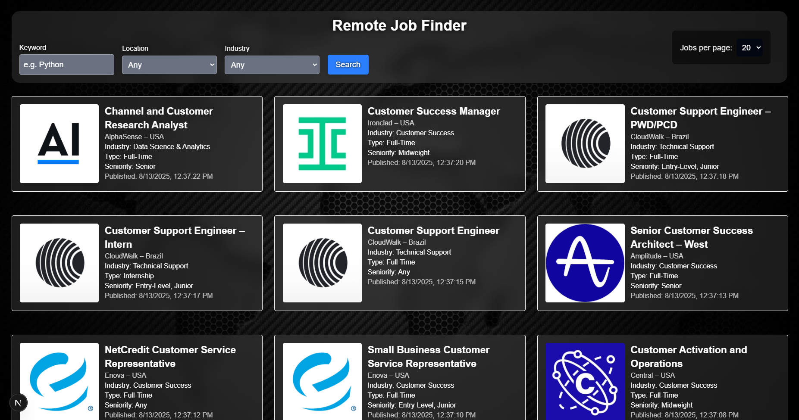
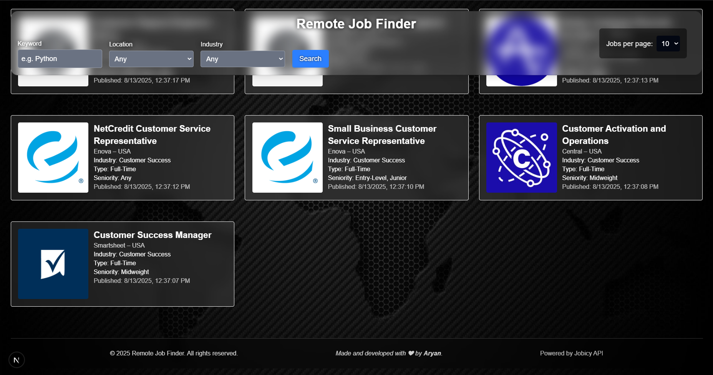
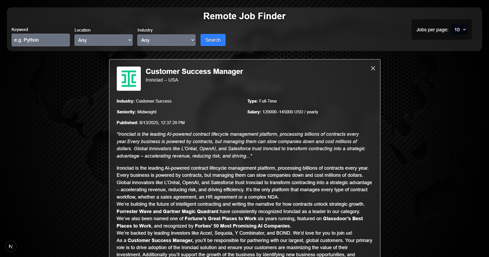
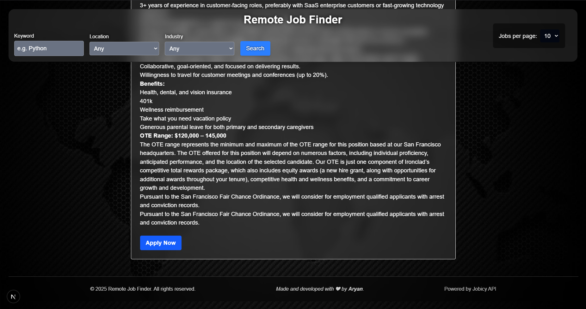

# Remote Job Finder

A modern, responsive web app for browsing remote jobs worldwide, powered by the [Jobicy API](https://jobicy.com).  
This project fetches live remote job listings and offers powerful filtering, pagination, and detailed job views with a clean, sleek UI built with React and Tailwind CSS.

---

## Features

- Fetches remote jobs data dynamically from the Jobicy API.
- Filter jobs by keyword, location (geo), industry, and job type.
- Detailed expandable job view with full description, salary, and meta info.
- Pagination with clickable page numbers for seamless browsing.
- Responsive grid layout with 2 job cards per row on desktop.
- Clean, modern UI with backdrop blur and smooth animations.
- Job descriptions render rich HTML safely.
- Footer with project credits and API attribution.

---

## Demo

<p align="center">
  <p>Home page</p> 
  
  
  
  
</p>

---

## Getting Started

### Prerequisites

- Node.js (v16+ recommended)
- npm or yarn package manager

### Installation

```bash
git clone https://github.com/yourusername/remote-job-finder.git
# then
cd remote-job-finder
# then
npm install


### Running Locally
npm run dev
```

Open [http://localhost:3000](http://localhost:3000) to view the app in your browser.

---

## Project Structure

- `pages/Page.jsx`: Main page component managing state, filters, pagination, and job data fetch.
- `components/Filters.jsx`: Filter UI with keyword, location, industry, job type, and sorting options.
- `components/JobList.jsx`: Displays job items in a 2-column responsive grid.
- `components/JobItem.jsx`: Individual job card with basic info, safe HTML decoding.
- `components/JobDetail.jsx`: Expanded job view with detailed info, full description, and external application link.
- `lib/jobService.js`: API helper for fetching and decoding job data from Jobicy with filter parameters.
- `assets/world.jpg`: Background image for main page.
- `globals.css`: Tailwind and custom animations.

---

## Usage

- Use the filter bar at the top to search by keyword, location, industry, and job type.
- Change the “Jobs per page” dropdown to control pagination size.
- Click on any job card to expand an animated detailed view with full info and apply link.
- Use page number buttons below the job list to navigate through job pages.
- All filters and pagination update data from the Jobicy API live.

---

## Customization

- Modify or extend filters in `Filters.jsx` and add corresponding API params in `lib/jobService.js`.
- Update styling via Tailwind config or `globals.css`.
- Replace background image with your own in `assets/`.
- Enhance detail view in `JobDetail.jsx` with more job metadata or styling.

---

## Technologies Used

- React
- Tailwind CSS for styling and layout
- Jobicy Remote Jobs API
- Fetch API for data requests

---

## Contributing

Contributions welcome!  
Feel free to open issues or pull requests for bug fixes, improvements, or feature requests.

---

## Author

Written and developed by **Aryan**.

---

## Acknowledgments

Special thanks to [Jobicy](https://jobicy.com/jobs-rss-feed) for their comprehensive and free remote jobs API.

---

## Contact

For questions or feedback, please open an issue or contact me via GitHub or on my LinkedIn.